# 📘 Bukku Online (`makanpos.bukku.my`) — Comprehensive Feature & Architecture Specification

> **Analysis Source**: Direct live inspection and authenticated API discovery of `makanpos.bukku.my`  
> **Target System**: Bukku Cloud Accounting & MiniPOS Platform (Malaysia)  
> **Prepared For**: SAPAR Core ERP Architecture & Parity Benchmarking  
> **Date**: September 2026

---

## 📑 Table of Contents
1. [Executive Summary & Organization Profile](#1-executive-summary--organization-profile)
2. [Global Architecture & Navigation Map](#2-global-architecture--navigation-map)
3. [Sales & Revenue Workflow (Order-to-Cash)](#3-sales--revenue-workflow-order-to-cash)
4. [Purchases & Expense Claims (Procure-to-Pay)](#4-purchases--expense-claims-procure-to-pay)
5. [Shoebox (Smart Receipt & Document OCR)](#5-shoebox-smart-receipt--document-ocr)
6. [Banking, Cash & Automated Bank Feeds](#6-banking-cash--automated-bank-feeds)
7. [Contacts Management & CRM](#7-contacts-management--crm)
8. [Products, Bundles & Perpetual Inventory](#8-products-bundles--perpetual-inventory)
9. [National E-Invoicing Engine (LHDN MyInvois)](#9-national-e-invoicing-engine-lhdn-myinvois)
10. [MiniPOS (Cloud Point of Sale)](#10-minipos-cloud-point-of-sale)
11. [Accounting, General Ledger & Fixed Assets](#11-accounting-general-ledger--fixed-assets)
12. [Reports Hub (69+ Specialized Reports)](#12-reports-hub-69-specialized-reports)
13. [Control Panel, Form Designs & Configuration](#13-control-panel-form-designs--configuration)
14. [SME Financing Portal (Embedded Fintech)](#14-sme-financing-portal-embedded-fintech)
15. [E-Commerce Store (CP-Store)](#15-e-commerce-store-cp-store)
16. [Comprehensive Benchmark: Bukku vs. SAPAR ERP](#16-comprehensive-benchmark-bukku-vs-sapar-erp)

---

## 1. Executive Summary & Organization Profile

Bukku is an established cloud accounting and ERP platform engineered primarily for Malaysian and Southeast Asian SMEs. The following environment parameters were retrieved directly via authenticated API session from **`makanpos.bukku.my`**:

| Parameter | Live Setting / Value |
|---|---|
| **Subdomain** | `makanpos` (`makanpos.bukku.my`) |
| **Legal Entity Name** | `MakanPOS` |
| **Base Currency** | `MYR` (`RM` — Malaysian Ringgit) |
| **Country Code** | `MY` (Malaysia) |
| **Inventory System Mode** | **Perpetual Inventory** (Real-time automated COGS and asset postings) |
| **Active Add-on Applications** | `ACCOUNTING` (Full General Ledger) + `MINIPOS` (Cloud Point of Sale) |
| **Tax Regime Support** | LHDN **MyInvois** (National E-Invoicing) & **SST** (Sales & Service Tax) |
| **API Base URL** | `https://api.bukku.my` |
| **Authentication Flow** | Bearer JWT + `Company-Subdomain: makanpos` header validation |

---

## 2. Global Architecture & Navigation Map

```mermaid
graph TD
    Dashboard[Executive Dashboard & Forecasting] --> Sales[Sales & Invoicing]
    Dashboard --> Purchases[Purchases & Expense Claims]
    Dashboard --> Shoebox[Shoebox Document OCR]
    Dashboard --> Banking[Bank Accounts & Feeds]
    Dashboard --> Contacts[Contacts & Credit Limits]
    Dashboard --> Inventory[Products, Bundles & Stock]
    Dashboard --> Accounting[General Ledger & Assets]
    Dashboard --> MiniPOS[MiniPOS Cashier Terminal]
    Dashboard --> MyInvois[LHDN MyInvois E-Invoicing]
    Dashboard --> Reports[69+ Reports Hub]
    Dashboard --> ControlPanel[Control Panel & Form Customizer]
    Dashboard --> Financing[Financing Portal]
```

### Executive Dashboard Features:
* **Cashflow Trend Chart**: Interactive 14-day / 30-day cash inflow vs. outflow visual trajectory.
* **Cashflow Forecast**: Predictive projection balancing pending receivables against pending bills.
* **Income & Expense Donut Breakdowns**: Category-level financial distribution with toggleable sub-accounts.
* **Bank Watchlist**: Real-time operating account balances.
* **Automated Business Digest**: Configurable weekly/monthly email summaries delivered to management.
* **Coming-Due Auto Notifications**: Customer payment reminders dispatched on custom intervals (e.g., 3 days before, on due date).

---

## 3. Sales & Revenue Workflow (Order-to-Cash)

Bukku covers the entire order-to-cash lifecycle across standard credit and immediate cash sales:

### 3.1. Document Pipeline
* **Quotations (`/sales/quotes`)**:
  * Multi-item pricing, trade discounts, line item notes, customer tags.
  * Configurable expiry dates and terms.
  * 1-Click conversion into **Sales Orders** or **Invoices**.
* **Sales Orders (`/sales/orders`)**:
  * Formal sales commitment tracking.
  * Automatic inventory allocation/reservation.
* **Delivery Orders (`/sales/delivery-orders`)**:
  * Official transport challans tracking carrier, driver, vehicle plate, and delivery status.
  * Generates packing lists without financial amounts if needed.
* **Sales Invoices (`/sales/invoices`)**:
  * Full itemized billing with automated tax calculation (SST 0%, 6%, 8%, or Exempt).
  * Multi-currency support with fixed conversion rates.
  * Shareable public customer link (`/view/:id/:ct` & `/pay`) featuring client payment gateways.
  * Embedded MyInvois verification QR codes and digital cryptographic validation status.
* **Batch Cash Invoices (`/sales/invoices/batch-cash`)**:
  * Rapid entry modal for retail cash transactions where separate billing and receipting are redundant.
* **Interest Invoices (`/sales/invoices/interest_invoices/batch`)**:
  * Automated periodic calculation and generation of interest penalty invoices for overdue customer debts.
* **Credit Notes (`/sales/credit-notes`)**:
  * Sales return processing, inventory restocking, and credit allocation against open invoices.
* **Payments Received (`/sales/payments`)**:
  * Official Receipt generation, multi-invoice balance allocation, partial payments, and unallocated deposits.
* **Customer Refunds (`/sales/refunds`)**:
  * Direct payout records returning surplus credit funds to customer bank accounts.
* **Opening Invoices (`/sales/opening-invoices`)**:
  * Onboarding tool for importing historical unpaid customer balances.

---

## 4. Purchases & Expense Claims (Procure-to-Pay)

A structured supplier procurement and employee claims engine:

* **Purchase Orders (`/purchases/orders`)**:
  * Supplier procurement orders with expected delivery dates and line item costs.
  * Direct 1-click conversion to supplier **Bills**.
* **Goods Received Notes / GRN (`/purchases/goods-received-notes`)**:
  * Warehouse intake documentation confirming physical receipt and stock condition prior to invoice arrival.
* **Bills (`/purchases/bills`)**:
  * Vendor accounts payable recording with payment terms, tax deductibility, and project expense tagging.
* **Batch Expense Claims (`/purchases/bills/batch-expense-claims`)**:
  * Staff expense submission and bulk reimbursement reconciliation.
* **Batch Cash Bills (`/purchases/bills/batch-cash`)**:
  * Fast recording of direct cash purchases.
* **Purchase Credit Notes (`/purchases/credit-notes`)**:
  * Adjustments for vendor returns, short shipments, and supplier rebates.
* **Payments Made (`/purchases/payments`)**:
  * Payment voucher generation, cheque numbers, electronic fund transfers (EFT), and batch payments.
* **Vendor Refunds (`/purchases/refunds`)**:
  * Recording reimbursement funds returned from suppliers.
* **Opening Bills (`/purchases/opening-bills`)**:
  * Migration tool for outstanding vendor balances.

---

## 5. Shoebox (Smart Receipt & Document OCR)

Located at `/shoebox`, this module serves as a digital document inbox:
* **Drag-and-Drop & Mobile Snapping**: Upload images or PDF files of receipts, supplier invoices, and slips.
* **Intelligent Data Extraction**: OCR scanning identifying vendor, invoice date, total amount, and line item tax.
* **1-Click Conversion**: Converts verified scans into either **Supplier Bills** or direct **Bank Expenses**.
* **Attachment Archive**: Stores digital receipts directly linked to corresponding accounting transactions for audit trails.

---

## 6. Banking, Cash & Automated Bank Feeds

Located at `/bank`:
* **Account Register (`/bank/accounts`)**:
  * Multi-currency bank accounts, cash in hand, petty cash, and corporate credit cards.
* **Bank Incomes (`/bank/incomes`)**:
  * Direct income receipts that do not require customer invoices (e.g. capital injections, interest, subsidies).
* **Bank Expenses (`/bank/expenses`)**:
  * Direct operating cash outflows not tied to vendor bills (e.g. bank charges, road tax, minor repairs).
* **Bank Transfers (`/bank/transfers`)**:
  * Inter-account funds transfers with foreign exchange conversion and auto-calculated exchange gain/loss.
* **Automated Bank Feeds (`/bank/feeds`)**:
  * Direct API connections with commercial banks (Maybank, CIMB, RHB Bank) to import daily statement lines automatically.
* **Bank Reconciliation (`:accountId/reconcile`)**:
  * Dual-column matching interface comparing bank statement lines with ledger transactions, complete with rule-based auto-reconciliation.

---

## 7. Contacts Management & CRM

Located at `/contacts`:
* **Unified Master Directory**: Centralized management of Customers, Suppliers, and Dual-Role partners.
* **Credit Limit & Security Passcode**:
  * Allows assigning credit limits per customer.
  * Includes a **Credit Limit Passcode** requirement, preventing sales personnel from issuing orders or invoices exceeding limits without supervisor authorization.
* **Customer & Supplier Statements**:
  * Formatted periodic statements of account with running balances and aging intervals.
  * 1-Click dispatch via email or printable PDF.
* **Batch Tools**:
  * Bulk contact updating, group classification, and merging duplicate records.
* **TIN & Legal Validation**:
  * Validation of Tax Identification Numbers against official revenue registries.
* **Payment Mandates**:
  * Recurring auto-debit collection mandates via integrated providers (e.g. Curlec / FPX).

---

## 8. Products, Bundles & Perpetual Inventory

Located at `/products`:
* **Catalog Management**:
  * Physical inventory items, non-inventory supplies, and service offerings.
  * SKU, barcode (EAN-13), description, cost price, and selling price.
* **Product Bundles / Assembly (`/products/bundles`)**:
  * Composite products / Bill of Materials (BOM).
  * Automatically depletes constituent raw materials or components upon bundle sale.
* **Perpetual Inventory Valuation**:
  * Real-time automated posting of Cost of Goods Sold (COGS) and inventory asset debits/credits.
  * Valuation options: Weighted Moving Average and FIFO.
* **Stock Adjustments (`/products/adjustments`)**:
  * Physical stock take reconciliation, damaged goods write-offs, and opening inventory setups.
* **Multi-Location Warehousing (`/cp/locations`)**:
  * Tracking quantities across separate warehouses, retail outlets, and transit locations.
* **Tiered Price Levels (`/cp/price-levels`)**:
  * Custom price tiers (Wholesale, Retail, VIP, Distributor) automatically assigned based on customer tier.

---

## 9. National E-Invoicing Engine (LHDN MyInvois)

Located at `/myinvois`:
* **Direct Tax Authority Connector**: Compliant with Inland Revenue Board of Malaysia (LHDN) e-Invoicing guidelines.
* **Outgoing Document Dispatch**:
  * Formats invoices, credit notes, and debit notes into required XML/JSON schemas.
  * Real-time status callbacks: *Valid, Invalid, Rejected, Cancelled*.
* **Incoming Document Capture**:
  * Automatically retrieves e-invoices issued by suppliers for automated purchase bill matching.
* **B2C Consolidated E-Invoicing**:
  * Aggregates high-volume retail transactions into single periodic consolidated e-invoices for tax compliance.
* **Digital Signature & QR Code**:
  * Embeds cryptographically signed validation links and QR codes on printed and online customer views.

---

## 10. MiniPOS (Cloud Point of Sale)

Located at `/minipos`:
* **Touchscreen Cashier Interface**: Responsive grid optimized for tablets, laptops, and touch displays.
* **Fast Catalog & Barcode Search**: Category-based tile navigation and continuous barcode scanning.
* **Multi-Tender Payments**: Cash, credit cards, debit cards, QR Pay, and digital e-wallets.
* **E-Invoicing Bridge**: Instantly generates simplified digital receipts or issues full individual e-invoices upon customer request.
* **Hardware Compatibility**: Standard thermal receipt printers, barcode readers, and automated cash drawers.

---

## 11. Accounting, General Ledger & Fixed Assets

Located at `/accounting`:
* **Chart of Accounts (`/accounting/accounts`)**:
  * Hierarchical structure across Assets, Liabilities, Equity, Revenue, Cost of Goods Sold, and Expenses.
  * Customizable account numbering and sub-accounts.
* **Journal Entries (`/accounting/journal-entries`)**:
  * Manual double-entry journals, recurring journal schedules, and batch CSV imports.
* **Contras (Mutual Settlement / Vzaimozachet) (`/accounting/contras`)**:
  * Offset receivable balances against payable balances when a company acts as both customer and supplier.
* **Fixed Asset Register (`/accounting/assets`)**:
  * Asset acquisition tracking, asset categories, and salvage values.
  * **Automated Depreciation**: Configurable Straight-Line or Reducing Balance depreciation schedules with 1-click batch journal postings.
  * **Asset Disposal (`:id/dispose`)**: Automated calculation of net book value, proceeds, and gain/loss on disposal.
* **Payroll Journal Entries (`/accounting/journal-entries/payroll`)**:
  * Integration importing wage expenses, employee contributions, and statutory withholdings.
* **Opening Balance Setup Wizard**:
  * Guided onboarding interface ensuring trial balance equilibrium upon setup.

---

## 12. Reports Hub (69+ Specialized Reports)

Located at `/reports/all`, Bukku includes an exhaustive financial intelligence suite:

### 12.1. Core Financial Statements
* **Balance Sheet (`/reports/balance-sheet`)**
* **Profit & Loss (`/reports/profit-loss`)**
* **Cash Flow Statement (`/reports/cash-flow`)**
* **Trial Balance (`/reports/trial-balance`)**
* **General Ledger (`/reports/general-ledger`)**
* **Financial Summary (`/reports/financial-summary`)**

### 12.2. Aging & Counterparty Ledgers
* **Aged Receivables (Summary & Detail) (`/reports/aged-receivables/...`)**
* **Aged Payables (Summary & Detail) (`/reports/aged-payables/...`)**
* **Debtor Ledger (`/reports/debtor-ledger`)**
* **Creditor Ledger (`/reports/creditor-ledger`)**

### 12.3. Sales Performance & Profitability
* **Product Sales (Summary & Detail) (`/reports/product-sales/...`)**
* **Product Bundle Sales (`/reports/product-bundle-sales/summary`)**
* **Customer Sales (`/reports/customer-sales/summary`)**
* **Item Sales Collection (`/reports/item-sales-collection`)**
* **Profit Summary & Detail (`/reports/profit-detail`)** — Exact gross margin % per item and invoice.
* **Tag Sales Summary (`/reports/tag-sales/summary`)** — Revenue broken down by project or department tag.

### 12.4. Purchases & Payables
* **Product Purchases (Summary & Detail) (`/reports/product-purchases/...`)**
* **Supplier Purchases Summary (`/reports/supplier-purchases/summary`)**
* **Supplier Orders Summary (`/reports/supplier-orders`)**
* **Bill Summary, Payment Voucher Summary, Official Receipt Summary**

### 12.5. Inventory & Warehouse Intelligence
* **Inventory Summary & Detail (`/reports/inventory/...`)**
* **Inventory Summary by Location (`/reports/inventory-summary-by-location`)**

### 12.6. Banking & Reconciliation
* **Bank Reconciliation Report (`/reports/bank-reconciliation`)**
* **Reconciled Transactions Log (`/reports/reconciled-transactions`)**

### 12.7. Statutory Tax & Compliance (SST)
* **SST-02 Return Form (`/reports/sst-02`)**
* **SST Sales & Purchase Detail Reports**
* **SST Deemed Payments, Past Prepayments, Recovered Payments**

### 12.8. Multi-Currency & Forex
* **Foreign Exchange Summary (`/reports/foreign-exchange-summary`)**
* **Unrealised Exchange Gain/Loss Detail (`/reports/unrealised-exchange-detail`)**
* **Historical Exchange Rates (`/reports/exchange-rates`)**

### 12.9. Fixed Assets Schedules
* **Fixed Assets Register (`/reports/fixed-assets`)**
* **Depreciation Schedule (`/reports/depreciation-schedule`)**
* **Disposal Schedule (`/reports/disposal-schedule`)**

### 12.10. Audit Trails & Governance
* **Audit Trail Report (`/reports/audit-trails`)** — Granular change logs documenting user actions, timestamp, previous vs. updated values.
* **Transaction List (`/reports/transaction-list`)**
* **Double Entry Detail & Journal Entry Detail**

---

## 13. Control Panel, Form Designs & Configuration

Located at `/cp`:
* **Form Designs Customizer (`/cp/form-designs`)**:
  * Visual WYSIWYG editor for customizing Invoices, Quotations, Delivery Orders, Credit Notes, Purchase Orders, Bills, Payment Vouchers, and Official Receipts.
  * Configurable company logos, color schemes, font sizes, custom labels, payment instructions, and QR codes.
* **Custom Number Formats (`/cp/number-formats`)**:
  * Setting document numbering structures with variable tokens (e.g., `INV-{YYYY}{MM}-{0001}`).
* **Default Account Mappings (`/cp/settings`)**:
  * Pre-allocates default accounts for Sales, Sales Returns, Cost of Sales, Inventory, Purchase Discounts, and Currency Rounding.
* **Custom Fields (`/cp/fields`)**:
  * Adding user-defined fields across invoices, bills, products, and contacts.
* **Tags Management (`/cp/tags`)**:
  * Multi-dimensional dimension tagging for cost centers, branches, or marketing initiatives.
* **Payment Methods & Terms (`/cp/payment-methods`, `/cp/terms`)**:
  * Setting credit terms (Net 30, COD, Due on Receipt) and accepted payment instruments.
* **User Roles & Permissions (`/cp/users`)**:
  * Access tiers: Administrator, Senior Accountant, Staff Accountant, Salesperson, Inventory Manager, View Only.
* **Automated Data Backup (`/cp/backup-data`)**:
  * Complete 1-click database export in structured format.

---

## 14. SME Financing Portal (Embedded Fintech)

Located at `/financing-portal`:
* **Integrated Working Capital Financing**:
  * Embedded partnership with commercial banks and digital lenders.
* **Instant Underwriting Engine**:
  * Evaluates loan eligibility and pre-approved credit lines directly from the verified ledger balance, invoicing turnover, and customer payment history without paper tax documents.

---

## 15. E-Commerce Store (CP-Store)

Located at `/cp-store`:
* **Online Product Catalog**: Publish items from the inventory master directly to a web store.
* **Categories & Pages**: Manage customer-facing storefront categories, banners, and policies.
* **Coupons & Promotional Rules**: Percentage or fixed-amount checkout discounts.
* **Order Processing**: Automatic transformation of online customer orders into Sales Orders and Invoices.

---

## 16. Comprehensive Benchmark: Bukku vs. SAPAR ERP

| Operational Domain | Bukku Online (Malaysia) | SAPAR ERP (Uzbekistan & Central Asia) |
|---|---|---|
| **Target Market** | Malaysia & Southeast Asia | **Uzbekistan, Kazakhstan & Central Asia** |
| **Accounting Standard** | Malaysia MPERS / FRS | **21-son BHMS (National Accounting Standard)** |
| **Chart of Accounts** | Flexible numeric hierarchy | **0100–9900 Standard Uzbekistan Chart of Accounts** |
| **Electronic Invoicing** | LHDN **MyInvois** API | **Didox.uz / Factura.uz / Soliq E-Faktura API** |
| **Digital Signatures** | LHDN Portal Credentials / Token | **National E-IMZO (`127.0.0.1:64443`) PKCS#7** (.pfx / USB e-token) |
| **Statutory Tax Returns** | SST-02 Return | **Form 10006_29 (QQS 12%), 11101_14 (JShODS), 10104_18 (4%)** |
| **Financial Statements** | Standard P&L, Balance Sheet | **1-Shakl (Buxgalteriya balansi) & 2-Shakl (Moliyaviy natijalar)** |
| **Banking Integration** | Malaysian Bank Feeds (Maybank, CIMB, RHB) | **1C:ClientBank Parser** (Ipak Yo‘li, Kapitalbank, Agrobank, etc.) |
| **Payment Gateways** | FPX, Curlec, Stripe, SenangPay | **Payme Business, Click Merchant, Uzum Pay** |
| **Specialized Documents** | Quotations, Delivery Orders | **Akt sverki (Reconciliation), Ishonchnoma M-2, Shartnomalar** |
| **Point of Sale** | MiniPOS | **Sensorli Touch POS + Shift X/Z Fiscal Reports** |
| **HRM & Payroll** | General Ledger Payroll Journal | **Full Tabel Attendance + Automated JShODS/INPS/Social Tax** |
| **Inventory Valuation** | Perpetual (Moving Average / FIFO) | **Strict FIFO Cost Layers & Omborlararo ko‘chirish** |
| **Financing Mechanism** | Malaysian SME Financing Portal | **National Bank Underwriting API (1-Day Working Capital)** |

---

*Document generated via live system inspection of Bukku platform.*
