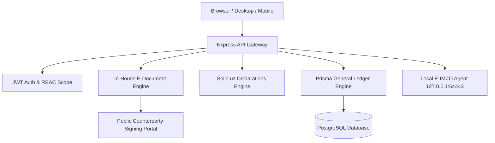

# 📘 SAPAR ERP — Master Feature Walkthrough & System Architecture Guide

> **Official Comprehensive Guide for Uzbekistan & Central Asia Business Operations**  
> **Version**: 2026 Enterprise Edition  
> **Standards**: Oʻzbekiston Respublikasi Soliq Qoʻmitasi (Soliq.uz), E-IMZO (`127.0.0.1:64443`), Didox/Factura EDO

---

## 📑 Table of Contents
1. [System Overview & Architecture](#1-system-overview--architecture)
2. [E-Hujjatlar & E-IMZO National Document Generators](#2-e-hujjatlar--e-imzo-national-document-generators)
3. [Uzbekistan State Tax Committee (Soliq) Declarations](#3-uzbekistan-state-tax-committee-soliq-declarations)
4. [Accounting, General Ledger & Financial Statements](#4-accounting-general-ledger--financial-statements)
5. [Sales & Commercial Document Workflow](#5-sales--commercial-document-workflow)
6. [Purchases & Supplier Payables](#6-purchases--supplier-payables)
7. [Multi-Warehouse & FIFO Inventory Management](#7-multi-warehouse--fifo-inventory-management)
8. [CRM, Contacts & Reconciliation Balances](#8-crm-contacts--reconciliation-balances)
9. [Banking, Multi-Currency & Petty Cash (Kassa)](#9-banking-multi-currency--petty-cash-kassa)
10. [Landing Page, Telemetry & Security Infrastructure](#10-landing-page-telemetry--security-infrastructure)

---

## 1. System Overview & Architecture

SAPAR is an enterprise-grade ERP built specifically for Uzbekistan and Central Asian enterprises:

---

## 2. E-Hujjatlar & E-IMZO National Document Generators

### 2.1. Solishtirma Dalolatnoma (Act of Reconciliation / Акт сверки)
- **Endpoint**: `POST /admin/e-documents/generate/akt-sverki`
- **UI Components**: `AktSverkiGeneratorModal.tsx` & `EDocumentViewer.tsx`
- **Capabilities**:
  - Automatically loads period invoices (Debit turnover) and payments/returns (Credit turnover).
  - Calculates opening balance, period turnover, closing balance, and identifies the debtor.
  - Formats an authentic 2-column comparative ledger (*Bizning hisobimizda* vs. *Kontragent hisobida*).
  - Direct E-IMZO dual signing and printable PDF export.

### 2.2. Ishonchnoma (Electronic Power of Attorney — Form № M-2 / M-2a)
- **Endpoint**: `POST /admin/e-documents/generate/empowerment`
- **UI Components**: `IshonchnomaGeneratorModal.tsx` & `EDocumentViewer.tsx`
- **Capabilities**:
  - Formal Uzbekistan Ministry of Finance Form M-2 template.
  - Tracks employee credentials (F.I.Sh., 14-digit PINFL, Passport series/number, issued by, position).
  - Itemized material goods table with 17-digit MXIK/IKPU codes and standard measurement packages.
  - Automatic 10-day validity expiry tracker.

### 2.3. Elektron Shartnomalar (Contracts & Document Templates)
- **Endpoint**: `POST /admin/e-documents/generate/contract`
- **UI Components**: `ContractGeneratorModal.tsx` & `EDocumentViewer.tsx`
- **Capabilities**:
  - Built-in legal templates: *Oldi-sotdi* (Sales), *Xizmat ko‘rsatish* (Services), *Yetkazib berish* (Supply), *Ijara* (Lease).
  - Dynamic company & counterparty requisites insertion (STIR, Director, Bank account, MFO, address).
  - Formatted legal numbered articles and dual cryptographic signature seals.

---

## 3. Uzbekistan State Tax Committee (Soliq) Declarations

Automated tax returns matching official Soliq.uz schemas:

### 3.1. QQS (VAT 12%) Monthly Declaration (Form 10006_29)
- **Route**: `GET /api/admin/reports/soliq-qqs` | **UI**: `SoliqQqsReport.tsx`
- **Summary**:
  - `Satr 010`: 12% taxable sales turnover
  - `Satr 040`: Total calculated output VAT
  - `Satr 050`: Deductible input VAT from supplier purchase invoices
  - `Satr 060`: Net payable VAT to the state budget (or `Satr 070` Refundable VAT)
- **Export**: Soliq-compliant JSON and print layout.

### 3.2. JShODS & Ijtimoiy Soliq Monthly Declaration (Form 11101_14)
- **Route**: `GET /api/admin/reports/soliq-jshods` | **UI**: `SoliqJshodsReport.tsx`
- **Summary**: Gross payroll fund, Income tax (12%), Social tax (12%), Individual pension accumulation (INPS 0.1%).

### 3.3. Aylanmadan Olinadigan Soliq (4% Turnover Tax — Form 10104_18)
- **Route**: `GET /api/admin/reports/soliq-aylanma` | **UI**: `SoliqAylanmaReport.tsx`
- **Summary**: Gross revenue from cash & bank operations, 4% flat turnover tax base and net payable sum.

---

## 4. Accounting, General Ledger & Financial Statements

- **Uzbekistan Chart of Accounts (Hisoblar rejasi)**: Native accounts (`4010`, `6010`, `5110`, `5010`, etc.).
- **Double-Entry Journal Entries (Provodkalar)**: Strict balance verification.
- **National Financial Reports**:
  - **1-Shakl**: Buxgalteriya balansi (Balance Sheet)
  - **2-Shakl**: Moliyaviy natijalar to‘g‘risida hisobot (Profit & Loss)
  - **Oborotka**: Aylanma vedomost (Trial Balance)

---

## 5. Sales & Purchases Workflow

- **Quotations & Proposals**: Multi-currency commercial offers with 1-click invoice conversion.
- **Sales Invoices**: MXIK codes, 12% VAT calculations, public verification links.
- **Delivery Challans (TTN / Yukxati)**: Transport waybills with driver details.
- **Purchase Orders & Supplier Payables**: Direct EDO invoice input deduction and AP aging.

---

## 6. Multi-Warehouse & FIFO Inventory Management

- **Multi-Warehouse Support**: Separate inventory tracking across central warehouses and regional retail points.
- **FIFO Costing**: Automated COGS calculation on sales.
- **Stock Transfers (Omborlararo ko‘chirish)**: Inter-warehouse movement logs with approval workflows.
- **Audits & Write-offs (Inventarizatsiya)**: Physical count variance adjustments.

---

## 7. Landing Page, Telemetry & Security Infrastructure

- **Multi-Language (i18n)**: Native support for **Ўзбек (Cyrillic)**, **Oʻzbek (Latin)**, **Русский**, and **English**.
- **Telemetry & Visitor Analytics**: [`/api/consent`](file:///c:/Users/Doston/Downloads/SAPAR/SaparLandingPage/app/api/consent/route.js) endpoint logging Vercel Edge geo-locations, IP addresses, and consent states.
- **Production Security Headers**: Strict CSP, HSTS, `X-Frame-Options: DENY`, `X-Content-Type-Options: nosniff`.
- **SEO & Indexation**: Dynamic `sitemap.xml` and `robots.txt` bound to **`sapar.uz`**.

---

*SAPAR ERP — Built with pride for Uzbekistan & Central Asia.*
