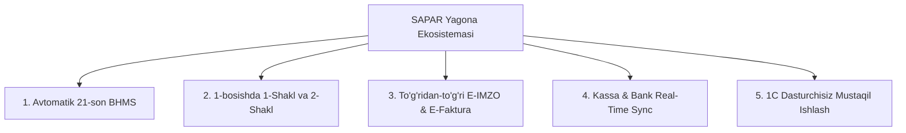

# 🌟 SAPAR ERP — Nega Biz 1C, Didox.uz, Factura.uz va Docco.uz dan Ustunmiz?
### Oʻzbekiston Biznesi va Bosh Buxgalterlar Uchun Milliy ERP Taqdimoti & Strategik Pitch Deck

---

## 🎯 1. Kirish: Oʻzbekiston Biznesining Asosiy Muammosi

Bugungi kunda Oʻzbekistondagi kompaniyalar va buxgalterlar biznesni boshqarishda **tarqoq va bir-biriga bogʻlanmagan 4-5 ta alohida dasturdan** foydalanishga majbur:
1. **1C (1С:Предприятие / 1С:Бухгалтерия)** — Murakkab, eski Windows interfeysi, har bir kichik oʻzgarish uchun 1C dasturchiga soatiga $30–$80 toʻlash kerak, bulutda (telefonda/Mac'da) ishlamaydi.
2. **Didox.uz / Factura.uz** — Faqat schyot-faktura yuborish (EDI). Buxgalteriya balansi, provodkalar, kassa, ombor yoʻq. Fakturalarni qoʻlda qayta 1C ga terib chiqish kerak.
3. **Docco.uz** — Faqat shartnoma imzolash. Moliyaviy tahlil, tovar harakati va CRM bilan aloqasi yoʻq.
4. **Alokompaniya kassa dasturi** — POS kassa alohida, bank alohida, ombor alohida.

> 💡 **SAPAR NIMA QILADI?**  
> SAPAR barcha bu boʻgʻinlarni **yagona, zamonaviy, tezkor bulutli platformada (Cloud ERP)** birlashtirdi! Bosh buxgalter, direktor, kassa va omborxona bir tizimda ishlaydi.

---

## ⚔️ 2. Toʻgʻridan-Toʻgʻri Solishtirma Matritsa (Competitive Matrix)

| Imkoniyatlar & Funksiyalar | SAPAR ERP 🚀 | 1C:Бухгалтерия 💾 | Didox.uz / Factura 📄 | Docco.uz ✍️ |
| :--- | :---: | :---: | :---: | :---: |
| **21-son BHMS Milliy Hisoblar Rejasi** | ✅ **Avtomatlashtirilgan** | ⚠️ Qoʻlda / Murakkab | ❌ Mavjud emas | ❌ Mavjud emas |
| **1-Shakl (Balans) & 2-Shakl (P&L)** | ✅ **1-bosishda real-time** | ⚠️ Oylik yopilish shart | ❌ Mavjud emas | ❌ Mavjud emas |
| **Aylanma Vedomost (Oborotka)** | ✅ **Interaktiv & Tezkor** | ⚠️ Sekin ochiladi | ❌ Mavjud emas | ❌ Mavjud emas |
| **Soliq E-Faktura (MXIK / IKPU)** | ✅ **Tizim ichida toʻgʻridan-toʻgʻri** | ⚠️ Qoʻshimcha modul kerak | ✅ Faqat EDO | ❌ Mavjud emas |
| **E-IMZO Milliy Raqamli Imzo** | ✅ **Brauzer orqali avtomatik** | ⚠️ Fayl eksport/import | ✅ Integratsiya bor | ✅ Integratsiya bor |
| **Chakana POS Kassa & Chek chop etish**| ✅ **Ovozli & Fullscreen POS** | ⚠️ Alohida 1C:Розница | ❌ Mavjud emas | ❌ Mavjud emas |
| **Akt Sverki (Solishtirma Dala)** | ✅ **Avtomatik generatsiya** | ⚠️ Sekin tuziladi | ❌ Mavjud emas | ⚠️ Oddiy shablon |
| **Bulutli (Mac, iPhone, Android, PC)** | ✅ **100% Bulutli & Tez** | ❌ Faqat Windows / RDP | ✅ Veb | ✅ Veb |
| **Xizmat Koʻrsatish Narxi** | 💰 **Arzon oylik obuna** | 💸 Qimmat litsenziya + 1C dasturchi | 💰 Har bir hujjatga haq | 💰 Oylik obuna |
| **QQS 12% va Soliq Deklaratsiyalari** | ✅ **Form 10006_29 avtomat** | ⚠️ Murakkab hisoblash | ❌ Mavjud emas | ❌ Mavjud emas |

---

## 💎 3. Bosh Buxgalterlar Uchun SAPAR'ning 5 Asosiy Afzalligi

### 1. 📖 21-son BHMS Milliy Standarti Doimiy Tayyor
- 4 xonali rasmiy milliy schyotlar (`0100` Asosiy vositalar, `1000` Materiallar, `2910` Ombordagi tovarlar, `4010` Xaridorlar, `5010` Kassa, `5110` Bank, `6010` Yetkazib beruvchilar, `6410` QQS 12%, `6710` Ish haqi, `9010` Tushum, `9110` Tannarx).
- Savdo yoki xarid amalga oshirilishi bilan **provodkalar avtomatik tuziladi**.

### 2. 📑 Davlat Moliyaviy Hisobotlari (1-Shakl va 2-Shakl)
- Bosh buxgalter haftalab hisobot tayyorlashi shart emas.
- **1-Shakl (Buxgalteriya Balansi)** va **2-Shakl (Moliyaviy Natijalar / P&L)** hamda **Aylanma Vedomost (Oborotka)** istalgan soniyada real maʼlumotlar asosida 100% balanslangan holda koʻrsatiladi va chop etiladi.

### 3. ✍️ Didox / Factura / E-IMZO Tizim Ichida
- Alohida saytlarga kirib, schyot-fakturani qoʻlda qayta kiritish shart emas.
- SAPAR'dagi hisob-faktura toʻgʻridan-toʻgʻri milliy E-IMZO bilan imzolanadi va yuboriladi.

### 4. 🛒 Sensorli POS Kassa va Ovozli Terminal
- Kassirlar uchun qulay **Toʻliq Ekran (Fullscreen)** kassa rejimi.
- Tovar oʻqilganda **ovozli beep (Web Audio)**, toʻlov olinganda **kassa jiringlashi (ching)**.
- Mahsulotning **MXIK/IKPU kodi**, 12% QQS va zaxira qoldigʻi kassa ekranida koʻrinadi.

### 5. 💰 Moliyaviy Tejamkorlik (ROI)
- 1C litsenziyasi va har oylik dasturchi xizmati oʻrtacha **oyiga 3 000 000 – 10 000 000 soʻm** talab qiladi.
- SAPAR bilan kompaniya ushbu xarajatlarni **80% gacha tejaydi** va qoʻshimcha dasturchisiz tizimdan foydalanadi.

---

## 👤 4. Maxsus Buxgalteriya Foydalanuvchisi (Accounting Specialist)

Biz tizimda faqat buxgalteriya bilan ishlovchi mutaxassislar uchun maxsus profil yaratdik:
- **Login**: `buxgalter@sapar.uz`
- **Parol**: `password123`
- **Vakolati**: 21-son BHMS Hisoblar rejasi, 1/2-shakl Davlat hisobotlari, Jurnallar & Provodkalar, Soliq QQS 12% deklaratsiyalari, Bank & Kassa, Akt sverka.

---

## 🚀 5. Mijozga Pitch Qilish Boʻyicha Qisqa Skript (Sales Pitch Script)

> *"Hurmatli [Ism], Siz hozirda buxgalteriyani 1C da, fakturalarni Didox/Factura.uz da, shartnomalarni Docco da, kassani esa alohida dasturda yuritasiz. Bitta hisobot chiqarish uchun hamma maʼlumotni qoʻlda yigʻib chiqishga toʻgʻri keladi.*  
>  
> *SAPAR — bu Oʻzbekiston standartlari (21-son BHMS, E-IMZO, Soliq QQS 12%) boʻyicha ishlab chiqilgan yagona bulutli tizim. Siz faktura yozishingiz bilan schyotlar provodkasi avtomatik oʻtadi, 1-shakl Balans va 2-shakl P&L oʻz-oʻzidan shakllanadi, kassa va bank hisobingiz esa doim 100% mutanosib turadi.*  
>  
> *1C dasturchilariga soatlab pul toʻlashni unuting — SAPAR istalgan kompyuter va telefonda toʻgʻridan-toʻgʻri brauzerda ishlaydi!"*
