<div align="center">

# 🏛️ SAPAR
### B2B SaaS Platform Automating Internal Audit & Financial Health Diagnostics for SMEs
#### Built for Uzbekistan & Central Asia 🇺🇿

[](https://awards.gov.uz)
[](https://github.com/dostontech/SaparCoreApp/actions/workflows/ci.yml)
[](https://lex.uz)
[](https://www.typescriptlang.org/)
[](https://react.dev/)
[](https://nodejs.org/)
[](https://www.postgresql.org/)

<p align="center">
  <b>SAPAR</b> is an intelligent B2B Fintech SaaS platform that automates internal audit and financial health diagnostics for SMEs. It eliminates reporting errors, prevents tax risks, and speeds up financial analysis by 70%, turning raw accounting ledgers into real-time executive dashboards.
</p>

> **🚀 Live Web Platform**: [https://sapar.uz](https://sapar.uz) (Production Portal & Interactive Sandbox)  
> **Project Pitch Video**: [Watch 3-Minute Video Presentation (Google Drive)](https://drive.google.com/file/d/10eupOOzO7Ngj6_Mq30RUknLswwcXw_OD/view?usp=sharing)  
> **Direct Navigation**: [Code Review Guide](#-code-review--navigation-guide-for-award-evaluators) • [Architecture](#-system-architecture) • [CI/CD Deployment](#-continuous-integration--cloud-deployment) • [Local Quick Start](#-quick-start--local-development)

---

</div>

## 🌟 Executive Overview & Problem Statement

In Uzbekistan and Central Asia, small and medium enterprises (SMEs) face critical accounting bottlenecks:
1. **Manual Audit Overhead**: Verifying subledger invoices, bills, and bank transactions against the General Ledger is slow, error-prone, and takes weeks.
2. **Tax Penalty Risks**: Discrepancies between billing records and official **Soliq.uz** filings (VAT 12%, Payroll/Social tax, Turnover tax) expose businesses to severe regulatory penalties.
3. **Delayed Decision-Making**: Business owners wait weeks for manual financial statements, lacking real-time visibility into cash flow, solvency, and operational margins.

**SAPAR solves these challenges with a real-time Fintech engine:**
* **70% Faster Financial Diagnostics**: Measured during pilot implementations with wholesale building materials and retail distribution enterprises in Namangan, reducing month-end subledger reconciliation, discrepancy diagnostics, and Soliq tax review time from ~14 hours to under 4 hours.
* **Proactive Tax Risk Elimination**: Live calculation of Soliq declarations (**Form 10006_29 QQS**, **Form 11101_14 JShODS/Social Tax**, and **Form 10104_18 Turnover Tax**) with MXIK/IKPU code validation.
* **Executive Diagnostics**: Instant transformation of transactional data into National Accounting Standard 21 (**BHMS 1-shakl Balans** and **2-shakl Moliyaviy Natijalar**) alongside real-time executive KPI dashboards.

```mermaid
flowchart LR
    subgraph Transactions["⚡ Real-Time Transactions"]
        A[Retail POS & UzQR Unified QR]
        B[Wholesale Invoicing & E-Faktura]
        C[Multi-Warehouse FIFO Inventory]
        D[Bank Statements 1C:ClientBank]
        E[HRM & Automated Payroll]
    end

    subgraph Engine["🏛️ SAPAR Fintech Engine"]
        GL[NAS 21 Double-Entry General Ledger]
        Audit[Internal Audit & Tally Check Engine]
        Tax[Soliq.uz Tax Compliance Validator]
    end

    subgraph Outputs["📊 Real-Time Diagnostic Outputs"]
        F[1-shakl Buxgalteriya Balansi]
        G[2-shakl Moliyaviy Natijalar P&L]
        H[Soliq Declarations Form 10006 / 11101 / 10104]
        I[Executive Financial Health Dashboard]
    end

    Transactions --> Engine
    Engine --> Outputs
```



---

## 🏆 President Tech Award Submission

| Criteria | Official Application Details |
|---|---|
| **Project Name** | **SAPAR** ([sapar.uz](https://sapar.uz)) |
| **Application Type** | **Best Startup Project** |
| **Category** | **Fintech** |
| **Funding Stage** | **MVP (Working MVP ready with pilot clients)** |
| **Region of Activity** | **Namangan, Republic of Uzbekistan 🇺🇿** |
| **Project Pitch Video** | [Watch 3-Minute Presentation (Google Drive)](https://drive.google.com/file/d/10eupOOzO7Ngj6_Mq30RUknLswwcXw_OD/view?usp=sharing) |
| **National Alignment** | Digital Uzbekistan 2030 Strategy (Presidential Decree No. UP-6079) |
| **Key Economic Impact** | 70% reduction in financial diagnostic time, elimination of tax penalties, formalization of retail & wholesale cash flows |

### 👥 Team Members

| Name | Role | PINFL (JShShIR) | Key Responsibilities |
|---|---|---|---|
| **Abdulboriyev Dostonbek** | Team Leader, Manager, FullStack Developer, AI Engineer | `30912975990022` | System architecture, full-stack core development, automated diagnostic models |
| **Tukhtasinov Zoirbek** | Data Engineer | `50702055990024` | Financial data pipelines, transaction aggregation, ledger indexing |
| **Sharofiddinov Ulug'bek** | Audit & Tax Specialist | `50307056960027` | NAS 21 accounting compliance, Soliq tax validation rules, audit algorithms |

---

## 🇺🇿 Uzbekistan National Fintech & Compliance Innovations

### 1. 🔍 Automated Internal Audit Engine (Tally Check)
* Continuous subledger-to-GL audit:
  - **Accounts Receivable**: Validates open invoices against the `4010` control account.
  - **Accounts Payable**: Validates open supplier bills against the `6010` control account.
  - **Bank Reconciliation**: Verifies bank balance vs. GL balance vs. explained statement transactions with automatic discrepancy flagging.
* Single-click **Akt Sverki (Act of Reconciliation)** generator with digital verification links.

### 2. 📑 Soliq.uz Automated Tax Declarations & Risk Prevention
* **QQS (VAT 12%) Monthly Declaration** (*Form 10006_29*): Automated net tax payable calculation with input tax deduction verification.
* **JShODS & Social Tax Monthly Declaration** (*Form 11101_14*): Automated 12% income tax, 12% social tax, and 0.1% INPS calculation.
* **Turnover Tax (4% Simplified)** (*Form 10104_18*): Instant reporting for qualifying small businesses.
* Mandatory **MXIK / IKPU code catalog** integration for compliant e-invoicing.

### 3. 💳 Central Bank UzQR & National Payment Gateways
* **UzQR (Central Bank Unified QR)**: Dynamic fiscal QR generation and real-time payment confirmation polling.
* **National Payment Gateways**: Payme Business, Click Merchant, and Uzum Pay.
* **Bank Statement Integration**: Automated 1C:ClientBank statement parser supporting Ipak Yoʻli Bank, Kapitalbank, Anorbank, Agrobank, and Hamkorbank.

### 4. 🔑 Native E-IMZO Cryptographic Digital Signature
* Zero-friction integration with the state **E-IMZO browser agent** (`127.0.0.1:64443`).
* In-browser PKCS#7 signing of invoices, contracts, and acts of reconciliation using national `.pfx` certificates and USB e-tokens.

### 5. 🏷️ Full BHMS (National Accounting Standard 21)
* Standard 40-account chart conforming to Ministry of Economy and Finance standards.
* Real-time generation of **1-shakl (Buxgalteriya Balansi)** and **2-shakl (Moliyaviy Natijalar Toʻgʻrisida Hisobot)**.

---

## 🏗️ System Architecture

```
SaparCoreApp/
└── SaparCore/
    ├── sapar-typescript-backend/       # Node.js 22 LTS, Express, TypeScript, Prisma ORM, PostgreSQL
    │   ├── controllers/                # 63 modular business controllers (Fintech, Audit, Tax, POS)
    │   ├── lib/                        # General ledger engine, tenant isolation, E-IMZO crypto shims
    │   ├── prisma/                     # Enterprise relational database schema & migrations
    │   └── services/                   # Bank statement parsers, Soliq EDI hub, AI diagnostics
    │
    └── sapar-typescript-frontend/      # React 19, Vite, Tailwind CSS v4, Redux Toolkit
        ├── src/pages/admin/dashboard/  # Executive financial dashboards (Finance, Accounts, Sales, POS)
        ├── src/pages/admin/accounting/ # 1/2-shakl reports, Tally Check audit, Soliq tax views
        └── src/pages/admin/pos/        # Touchscreen POS terminal with UzQR dynamic QR checkout
```

## 🔄 Continuous Integration & Automated Cloud Deployment

* **GitHub Actions CI/CD Pipeline** (`.github/workflows/ci.yml`):
  - Automatically triggers on every push and pull request to `main`.
  - Compiles TypeScript for backend and frontend with zero errors.
  - **Automated CI Vitest Suite**: Executes 109 automated regression tests verifying double-entry ledger balance, multi-currency accounting, tax calculations, and inventory cost adjustments.
  - **Standalone Regulatory Test Suites** (`scripts/test-suite-*`): Dedicated verification scripts for Decree No. 296 digital marking (`test-suite-asl-belgisi-e2e.ts`), Central Bank UzQR (`test-suite-uzqr-e2e.ts`), E-IMZO PKCS#7 signing (`test-suite-eimzo.ts`), and Soliq tax filing (`test-suite-soliq-tax.ts`).
  - Verifies production Docker container builds for API and Web services.
* **Cloud Hosting & Production Deployment**:
  - Live staging and production instances are continuously deployed to **Render** via automated GitHub webhooks on merge to `main`.
  - Environment secrets (PostgreSQL connection strings, JWT keys) are securely managed via Render environment secret injection.

---

## 🧭 Code Review & Navigation Guide (For Award Evaluators)

To assist the President Tech Award jury and technical evaluators in reviewing the codebase efficiently, the table below maps each core Fintech innovation to its exact production implementation:

| Evaluated Module | Key Implementation Files | Architectural Highlights & What To Review |
|---|---|---|
| **1. Automated Internal Audit (Tally Check)** | • [`accountingReportController.ts`](./SaparCore/sapar-typescript-backend/controllers/accountingReportController.ts)<br>• [`TallyCheckReport.tsx`](./SaparCore/sapar-typescript-frontend/src/pages/admin/accounting/reports/TallyCheckReport.tsx) | **Continuous Subledger vs. GL Audit**: Real-time cross-verification of Accounts Receivable vs. open invoices, Accounts Payable vs. open supplier bills, and Bank account balances vs. GL control accounts with automated `Tied` / `Diverges` status flags. |
| **2. Soliq.uz Tax Risk Engine** | • [`soliqTaxReportsController.ts`](./SaparCore/sapar-typescript-backend/controllers/soliqTaxReportsController.ts)<br>• [`SoliqQqsReport.tsx`](./SaparCore/sapar-typescript-frontend/src/pages/admin/accounting/reports/SoliqQqsReport.tsx)<br>• [`SoliqJshodsReport.tsx`](./SaparCore/sapar-typescript-frontend/src/pages/admin/accounting/reports/SoliqJshodsReport.tsx) | **Automated Official Soliq Declarations**: Live calculation of QQS (VAT 12% — Form 10006_29), JShODS & Social Tax (12% + 12% + 0.1% INPS — Form 11101_14), and Turnover Tax (4% — Form 10104_18) with mandatory MXIK / IKPU code validation. |
| **3. BHMS 21 General Ledger (NAS 21)** | • [`bhmsAccountingController.ts`](./SaparCore/sapar-typescript-backend/controllers/bhmsAccountingController.ts)<br>• [`ledgerPosting.ts`](./SaparCore/sapar-typescript-backend/lib/ledger/ledgerPosting.ts)<br>• [`UzbekistanFinancialReportsPage.tsx`](./SaparCore/sapar-typescript-frontend/src/pages/admin/accounting/UzbekistanFinancialReportsPage.tsx) | **National Chart of Accounts & Statements**: Strict double-entry accounting engine under 21-son BHMS. Instant generation of **1-shakl (Buxgalteriya Balansi)** and **2-shakl (Moliyaviy Natijalar Toʻgʻrisida Hisobot)**. |
| **4. Central Bank UzQR & National Payments** | • [`uzqrService.ts`](./SaparCore/sapar-typescript-backend/services/uzqrService.ts)<br>• [`uzbekPaymentGatewaysController.ts`](./SaparCore/sapar-typescript-backend/controllers/uzbekPaymentGatewaysController.ts)<br>• [`UzQrCheckoutModal.tsx`](./SaparCore/sapar-typescript-frontend/src/pages/admin/pos/UzQrCheckoutModal.tsx) | **Unified Payment Infrastructure**: Dynamic UzQR Central Bank specification generator, webhook processors for Payme Business, Click Merchant, Uzum Pay, and real-time POS checkout polling. |
| **5. Automated Bank Statement Reconciliation** | • [`bankTransactionController.ts`](./SaparCore/sapar-typescript-backend/controllers/bankTransactionController.ts) | **1C:ClientBank Statement Parsing**: Automated statement ingestion for Ipak Yoʻli Bank, Kapitalbank, Anorbank, Agrobank, and Hamkorbank with auto-reconciliation against ledger cash accounts. |
| **6. E-IMZO State Digital Cryptography** | • [`eimzoService.ts`](./SaparCore/sapar-typescript-frontend/src/services/eimzoService.ts)<br>• [`eimzoController.ts`](./SaparCore/sapar-typescript-backend/controllers/eimzoController.ts) | **Native Digital Signatures**: Direct browser communication with state cryptographic agent (`127.0.0.1:64443`) for PKCS#7 signing using national `.pfx` keys and USB e-tokens. |
| **7. Executive Financial Health Dashboards** | • [`FinanceDashboard.tsx`](./SaparCore/sapar-typescript-frontend/src/pages/admin/dashboard/FinanceDashboard.tsx)<br>• [`AccountsDashboard.tsx`](./SaparCore/sapar-typescript-frontend/src/pages/admin/dashboard/AccountsDashboard.tsx) | **Real-Time C-Level Analytics**: Real-time solvency tracking, gross/net margins, working capital diagnostics, and automated financial health indicators. |
| **8. Multi-Tenant Enterprise Data Layer** | • [`schema.prisma`](./SaparCore/sapar-typescript-backend/prisma/schema.prisma)<br>• [`tenantScope.ts`](./SaparCore/sapar-typescript-backend/lib/tenantScope.ts) | **Data Security & Tenant Isolation**: Comprehensive PostgreSQL relational schema with row-level tenant enforcement, ACID guarantees, and audit logging on all financial mutations. |

---

## 🚀 Quick Start & Local Development

### 1. Prerequisites
- **Node.js**: v20.x or v22.x LTS
- **npm**: v10+
- **PostgreSQL**: 15+ (running locally or via cloud instance)

### 2. Backend Setup
```bash
# Navigate to the backend directory
cd SaparCore/sapar-typescript-backend

# Copy the sample environment file
cp .env.example .env
# Edit .env if you need to adjust database credentials or ports

# Install dependencies
npm install

# Push database schema & generate Prisma client
npx prisma db push

# Start the development server (runs on http://localhost:3005)
npm run dev
```

### 3. Frontend Setup
```bash
# Navigate to the frontend directory
cd ../sapar-typescript-frontend

# Copy the sample environment file
cp .env.example .env

# Install dependencies
npm install

# Start the Vite development server (runs on http://localhost:5173)
npm run dev
```

---

## 🔐 Security & Data Integrity

* **Multi-Tenant Isolation**: Every database query is strictly scoped to the authenticated organization.
* **Cryptographic Signatures**: Document authenticity verified via state-certified E-IMZO PKCS#7 signatures.
* **Audit Trail**: Full mutation logging (`AuditLog`) for all ledger, invoice, and payment transactions.
* **Zero Secret Exposure**: All production keys, certificates, and credentials are kept out of version control via comprehensive `.gitignore` rules.

For security policies and vulnerability reporting, see [SECURITY.md](./SECURITY.md).

---

## 📜 Intellectual Property & Copyright Notice

```
Copyright (c) 2026 SAPAR Technologies. All Rights Reserved.
Protected under the Intellectual Property Laws of the Republic of Uzbekistan (Law No. ZRU-42).
```

This source code is made available for evaluation, code audit, and award evaluation purposes. Unauthorized commercial deployment, redistribution, or white-labeling is strictly prohibited. See [LICENSE](./LICENSE) for terms.

---

<div align="center">
  <b>SAPAR — Empowering Uzbek SMEs with Real-Time Financial Diagnostics 🇺🇿</b><br>
  Official Website: <a href="https://sapar.uz">https://sapar.uz</a> • Contact: <a href="mailto:dbekk1i@gmail.com">dbekk1i@gmail.com</a>
</div>
