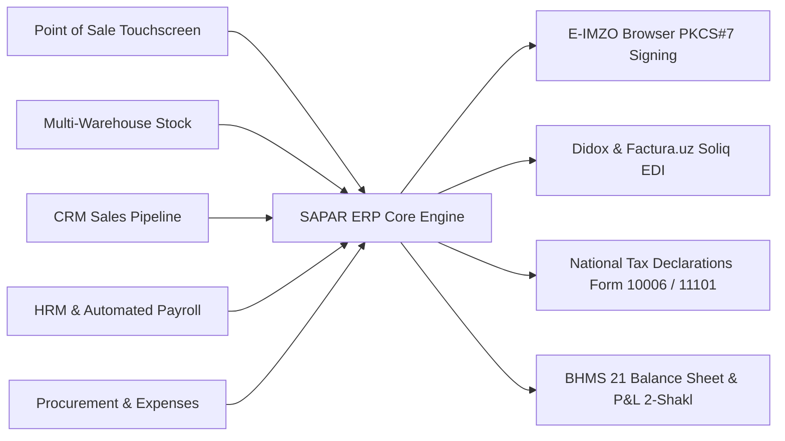

<div align="center">

# 🏛️ SAPAR ERP
### The Next-Generation Enterprise Operating System Built for Uzbekistan & Central Asia

[](https://awards.gov.uz)
[](https://lex.uz)
[](https://www.typescriptlang.org/)
[](https://react.dev/)
[](https://nodejs.org/)
[](https://www.postgresql.org/)
[](https://www.docker.com/)
[](./LICENSE)

<p align="center">
  <b>SAPAR ERP</b> is a high-performance, cloud-native enterprise resource planning system designed from the ground up for the economic, tax, and regulatory landscape of <b>Uzbekistan and Central Asia</b>.
</p>

[Live Demo](http://localhost:8080) • [API Documentation](./sapar_api_documentation.html) • [System Architecture](#-system-architecture) • [President Tech Award Dossier](#-president-tech-award-submission) • [Deployment Guide](#-quick-start--production-deployment)

---

</div>

## 🌟 Executive Overview

SAPAR ERP solves the fragmentation in Uzbekistan’s enterprise software market by replacing costly, desktop-bound foreign legacy systems (such as 1C) with a unified, modern web & mobile ecosystem.

Every transaction—from retail POS barcode scans to wholesale shipments, warehouse adjustments, employee work hours (*tabel*), and bank reconciliations—instantly updates the double-entry general ledger and national tax declarations in real time.



---

## 🇺🇿 Built for Uzbekistan — Core Innovations

### 1. 🔑 Native E-IMZO Digital Signature Cryptography
* Zero-friction integration with the state **E-IMZO browser agent** (`127.0.0.1:64443`).
* Direct in-browser cryptographic signing of invoices, contracts, and acts of reconciliation using national `.pfx` certificates and USB e-tokens.

### 2. 📑 Didox, Factura.uz & Soliq E-Faktura Connector
* Automated generation of Soliq-compliant electronic invoices with mandatory **MXIK / IKPU codes**.
* Automated inbound vendor invoice synchronization and PKCS#7 document verification.

### 3. 📊 State Tax Committee (Soliq) Tax Report Generator
* **QQS (VAT 12%) Monthly Declaration** (*Form 10006_29*).
* **JShODS (Personal Income Tax 12%) & Social Tax** (*Form 11101_14*).
* **Turnover Tax (4% Simplified)** (*Form 10104_18*).
* **IT Park Resident 0% Tax Profiles**.

### 4. 💳 National Payment Gateways & Banking
* **Payment Gateways**: Payme Business, Click Merchant, Uzum Pay.
* **Direct Bank Statement Parser**: 1C:ClientBank format parser for Ipak Yoʻli Bank, Kapitalbank, Anorbank, Agrobank, and Hamkorbank.

### 5. 🏷️ Full BHMS (National Accounting Standard 21)
* Double-entry bookkeeping conforming to the Ministry of Economy and Finance standards.
* Financial Statements: **Buxgalteriya Balansi (1-shakl)** and **Moliyaviy Natijalar (2-shakl)**.
* Automated **Akt Sverki (Reconciliation Statement)** generator with shareable client links.

---

## 🏆 President Tech Award Submission

| Criteria | SAPAR ERP Solution |
|---|---|
| **Category** | Best Enterprise Software / Digital Transformation in Uzbekistan |
| **National Alignment** | Digital Uzbekistan 2030 Strategy (Presidential Decree No. UP-6079) |
| **Economic Impact** | 60% reduction in accounting errors, formalization of retail/wholesale trade, elimination of foreign software currency drain |
| **Target Sectors** | MSMEs, Retail Chains, Construction & Building Materials, Wholesale Trade, Logistics, IT Park Companies |
| **Technology Stack** | 100% Modern Cloud Stack: TypeScript, Node.js 22, React 19, Tailwind v4, PostgreSQL 16, Docker |

---

## 🏗️ System Architecture

```
SAPAR/
├── SaparCore/
│   ├── docker/                         # Docker Compose, PostgreSQL 16, Nginx, Automated Backups
│   ├── sapar-typescript-backend/       # Express, Prisma ORM, E-IMZO crypto, Soliq engines, RBAC (63 modules)
│   └── sapar-typescript-frontend/      # React 19, Vite, Tailwind v4, Redux Toolkit, i18n (UZ/OZ/RU/EN)
├── SaparLandingPage/                   # Next.js 15, SSR, SEO-optimized localized marketing portal
├── guides/                             # Comprehensive end-user and accounting guides
└── LICENSE                             # Proprietary source-available commercial evaluation license
```

---

## 🚀 Quick Start & Production Deployment

### 1. Prerequisites
- Linux Server (Ubuntu 22.04/24.04 LTS) or Windows/macOS with Docker Desktop.
- Docker Engine + Docker Compose Plugin (`docker compose`).

### 2. Launching the Complete Stack
```bash
# 1. Clone the repository
git clone https://github.com/your-org/SAPAR.git
cd SAPAR/SaparCore

# 2. Configure environment secrets
cp docker/.env.example docker/.env
# Edit docker/.env with strong passwords and keys

# 3. Launch the stack
docker compose --env-file docker/.env -f docker/docker-compose.yml up -d --build
```

### 3. Verify Health
```bash
docker ps
# Access web portal: http://localhost:8080
# API Healthcheck:  http://localhost:8080/api/healthz
```

---

## 🔐 Security & Secret Protection

All sensitive credentials (`.env`, private keys, PFX certificates, database dumps) are strictly excluded via `.gitignore`. 
* Stored external credentials are encrypted at rest with **AES-256-GCM**.
* Every request is verified against strict JWT claims with multi-tenant data isolation.

For security policies and vulnerability reporting, see [SECURITY.md](./SECURITY.md).

---

## 📜 Intellectual Property & Copyright Notice

```
Copyright (c) 2026 SAPAR ERP Technologies. All Rights Reserved.
Protected under the Intellectual Property Laws of the Republic of Uzbekistan (Law No. ZRU-42).
```

This source code is made available for evaluation, code audit, and award evaluation purposes. Unauthorized commercial deployment, redistribution, or white-labeling is strictly prohibited. See [LICENSE](./LICENSE) for terms.

---

<div align="center">
  <b>SAPAR ERP — Built with pride for the Republic of Uzbekistan 🇺🇿</b><br>
  Official Inquiries: <a href="mailto:contact@sapar.uz">contact@sapar.uz</a> | <a href="https://sapar.uz">https://sapar.uz</a>
</div>
